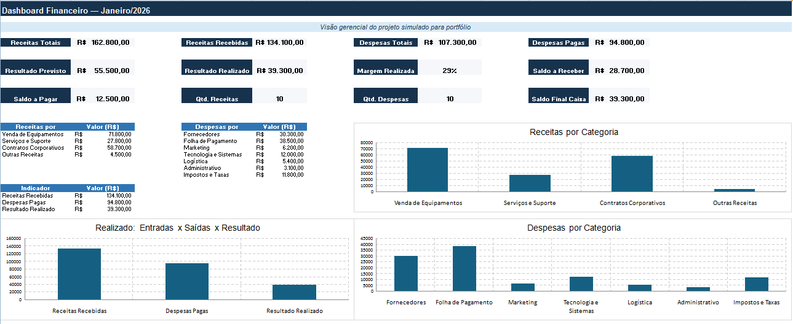

# 📊 Projeto Financeiro Dell — Controle Financeiro em Excel

> **Projeto simulado desenvolvido para fins de portfólio profissional.**  
> Não representa vínculo profissional ou trabalho realizado para a Dell Technologies.

## 🎯 Sobre o projeto

Projeto desenvolvido em Excel com o objetivo de simular uma rotina de controle financeiro empresarial, reunindo receitas, despesas, contas a receber, contas a pagar e fluxo de caixa.

A proposta foi aplicar conhecimentos de **Excel intermediário, organização de dados e controles financeiros**, transformando os registros em informações de fácil acompanhamento por meio de indicadores e gráficos.

## 📊 Dashboard Financeiro

O dashboard apresenta uma visão consolidada dos principais indicadores financeiros do projeto, permitindo acompanhar receitas, despesas, resultados e saldos.

### Principais indicadores

| Indicador | Resultado |
|---|---:|
| Receitas Totais | R$ 162.800,00 |
| Receitas Recebidas | R$ 134.100,00 |
| Despesas Totais | R$ 107.300,00 |
| Despesas Pagas | R$ 94.800,00 |
| Resultado Previsto | R$ 55.500,00 |
| Resultado Realizado | R$ 39.300,00 |
| Margem Realizada | 29,3% |
| Saldo a Receber | R$ 28.700,00 |
| Saldo a Pagar | R$ 12.500,00 |
| Saldo Final de Caixa | R$ 39.300,00 |

## 🗂️ Estrutura da planilha

O arquivo foi organizado nas seguintes áreas:

- **Cadastro:** apoio à organização e classificação dos registros;
- **Receitas:** controle das entradas financeiras;
- **Despesas:** acompanhamento das saídas;
- **Contas:** acompanhamento de valores a receber e a pagar;
- **Fluxo de Caixa:** consolidação das movimentações realizadas;
- **Dashboard:** visualização dos principais indicadores;
- **Fórmulas:** demonstração das funções utilizadas no projeto.

## 🧮 Fórmulas e recursos utilizados

Durante o desenvolvimento foram aplicados recursos de Excel de nível intermediário, incluindo:

- `PROCV (VLOOKUP)`
- `SEERRO (IFERROR)`
- `SOMASES (SUMIFS)`
- `CONT.SES (COUNTIFS)`
- `SE (IF)`
- `SOMA (SUM)`
- Cálculos percentuais
- Validação de dados
- Formatação condicional
- Tabelas
- Gráficos

## 💡 Competências demonstradas

- Excel intermediário
- Organização e tratamento de dados
- Controle de receitas e despesas
- Controle de contas a pagar e receber
- Fluxo de caixa
- Conferência de informações
- Construção de indicadores
- Elaboração de dashboard
- Atenção aos detalhes
- Organização administrativa e financeira

## 📁 Arquivo do projeto

A planilha completa está disponível neste repositório:

**`Projeto Financeiro Portfólio DELL.xlsx`**

> Para visualizar todas as fórmulas, controles e funcionalidades, faça o download do arquivo e abra-o no Microsoft Excel.

---

## 👩‍💼 Sobre este portfólio

Este projeto integra meu portfólio profissional voltado para oportunidades nas áreas de **Assistência Administrativa e Assistência Administrativa Financeira**.

Os dados utilizados são simulados e foram criados exclusivamente para fins de estudo, prática e demonstração de competências profissionais.
